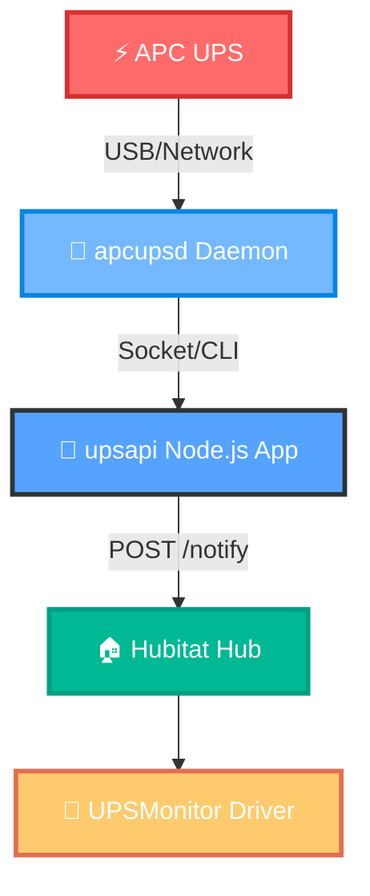

  
# ⚡ UPSAPI ⚡
### *Raspberry Pi UPS Monitoring & Hubitat Integration*

**🔋 Monitor your APC UPS from a Raspberry Pi and automate your smart home with Hubitat!**  
*Track power status, battery health, and automate alerts or actions when your UPS changes state.*

![Demo GIF or Screenshot Placeholder]

---

## � Documentation

| 📋 Document | 📝 Description |
|-------------|----------------|
| [🏗️ Project Overview](./docs/overview.md) | High-level architecture and data flow |
| [⚙️ apcupsd-scripts](./docs/apcupsd-scripts.md) | UPS daemon configuration |
| [🚀 app](./docs/app.md) | Node.js API server details |
| [🏠 Hubitat](./docs/hubitat.md) | Smart home integration guide |

---

## 🏗️ System Architecture

---

## ✨ Features

| Feature | Description |
|---------|-------------|
| 🔄 **Real-time Monitoring** | Live UPS status via network socket or CLI |
| 🌐 **REST API** | Clean endpoints for UPS status and metrics |
| ⏰ **Automated Polling** | Scheduled data push to Hubitat every 5 minutes |
| 🔔 **Smart Notifications** | Customizable alerts and device attributes |
| 🚀 **Easy Deployment** | One-command setup with PM2 and shell scripts |
| 🔧 **Extensible** | Add new metrics or automation rules easily |
| 📊 **Dashboard Ready** | Works seamlessly with Hubitat dashboards |
| 🔋 **Battery Health** | Track charge level, runtime, and voltage |

---

## 🚀 Quick Start

### 🎯 *Get up and running in minutes!*

| Step | Action | Command |
|------|--------|---------|
| **1️⃣** | **Prepare Raspberry Pi** | *Ensure OS is installed and networked* |
| **2️⃣** | **Setup SSH Keys** | `ssh-keygen -t rsa && ssh-copy-id pi@<PI_IP>` |
| **3️⃣** | **Install Dependencies** | `curl -sL https://raw.githubusercontent.com/neerpatel/upsapi/main/setup.sh \| sudo -E bash -` |
| **4️⃣** | **Deploy Application** | `curl -sL https://raw.githubusercontent.com/neerpatel/upsapi/main/app/ecosystem.config.js -O && pm2 deploy production setup && pm2 deploy production` |

### 🎉 **That's it! Your UPS monitoring is now live!**

---

## 🤝 Contributing

**🌟 We welcome your contributions! 🌟**

| Type | How to Help |
|------|-------------|
| 🐛 **Bug Reports** | Found an issue? [Open an issue](https://github.com/neerpatel/upsapi/issues/new) |
| ✨ **Feature Requests** | Have an idea? [Request a feature](https://github.com/neerpatel/upsapi/issues/new) |
| 🔧 **Code Contributions** | See our [CONTRIBUTING.md](CONTRIBUTING.md) guide |
| 📖 **Documentation** | Help improve our docs and examples |

*Check out our [Contributing Guidelines](CONTRIBUTING.md) to get started!*

---

## 💡 Why Choose UPSAPI?

| Benefit | Description |
|---------|-------------|
| 🛡️ **Peace of Mind** | Always know your backup power status |
| 🏠 **Smart Integration** | Automate lights, notifications, shutdowns on power events |
| 🔓 **Open Source** | Built for the community, by the community |
| ⚡ **Performance** | Lightweight, efficient, reliable monitoring |
| 🔧 **Flexibility** | Easy to customize and extend |

---

## 📬 Support & Community

**Questions? Ideas? Just want to chat?**  
*We'd love to hear from you!*

---

### 🌟 **Star this repo if it helped you!** 🌟

**Made with ❤️ for the Raspberry Pi and Home Automation community**

