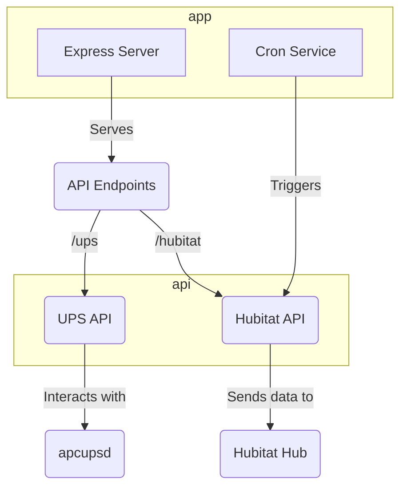

[Project Overview](./overview.md) | [apcupsd-scripts Documentation](./apcupsd-scripts.md) | [Hubitat Documentation](./hubitat.md)

# `app` Documentation

The `app` directory contains the core of the UPS monitoring application. It's a Node.js project that runs an Express server to provide an API for UPS data and a cron job to periodically poll the UPS status.

## Application Structure Diagram

## Key Files and Directories

### `server.js`
This is the main entry point for the Express web server. It initializes the server, sets up middleware (like `body-parser` and the Winston logger), and mounts the API routers.

### `cron.js`
This script sets up a `node-cron` job that periodically makes an HTTP request to the `/hubitat` endpoint of its own application. This triggers the process of fetching UPS data and sending it to the Hubitat hub. The cron schedule is configured in `ecosystem.config.js`.

### `ecosystem.config.js`
This is the configuration file for **PM2**, a process manager for Node.js. It defines two main processes:
-   **`upsapi`**: The main web server (`server.js`).
It also contains environment variables for both production and development, such as Hubitat IP/port, `apcupsd` network details, and the cron schedule.

### `api/`
This directory contains the API route handlers.

---
[Back to Overview](./overview.md) | [apcupsd-scripts Documentation](./apcupsd-scripts.md) | [Hubitat Documentation](./hubitat.md)
