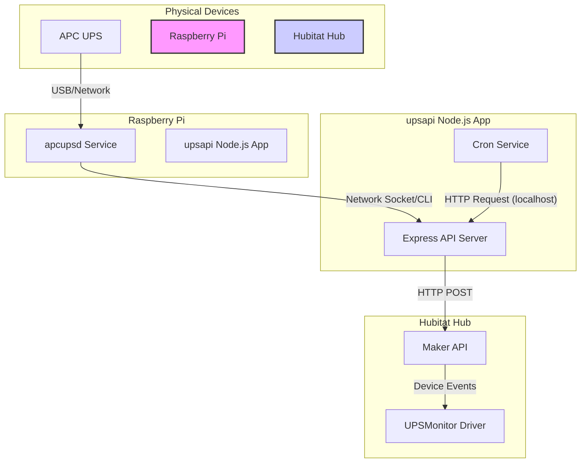
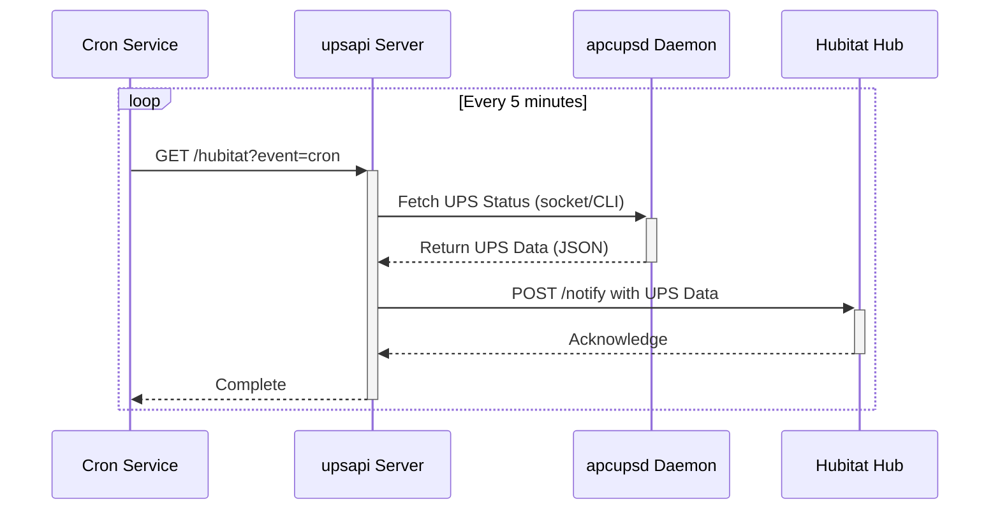

# Project Overview and Architecture
[apcupsd-scripts Documentation](./apcupsd-scripts.md) | [App Documentation](./app.md) | [Hubitat Documentation](./hubitat.md)

This document provides a high-level overview of the UPS monitoring system, explaining how the different components work together to bridge an APC UPS with a Hubitat home automation hub.

## System Architecture Diagram

The following diagram illustrates the main components of the system and their interactions.

## Data Flow

The data flows through the system in a continuous loop, initiated by a cron job.

### Step-by-Step Explanation

1.  **Cron Trigger**: The `cron.js` service, managed by PM2, runs on a schedule (e.g., every 5 minutes). It sends an HTTP GET request to its own `upsapi` server at the `/hubitat` endpoint.

2.  **Fetch UPS Data**: The `/hubitat` endpoint in the `upsapi` server receives the request. It then calls the internal `/ups/status` or `/ups/apcaccess` endpoint to get the latest data from the `apcupsd` daemon.

3.  **Communicate with `apcupsd`**: The `ups.js` API module communicates with the `apcupsd` daemon running on the Raspberry Pi. It can do this in two ways:
    -   **Network Socket (Primary)**: Connects to `apcupsd` on port 3551 for a fast and reliable data transfer.
    -   **`apcaccess` CLI (Fallback)**: Executes the `apcaccess` shell command and parses its text output.

4.  **Forward to Hubitat**: Once the `upsapi` server has the UPS data, it constructs a JSON payload and sends it to the Hubitat hub via an HTTP POST request to the Maker API endpoint.

5.  **Hubitat Processing**: The Hubitat Maker API receives the data and passes it to the `UPSMonitor` virtual device. The `UPSMonitor.groovy` driver code parses the JSON and updates the device's attributes (e.g., battery level, status, voltage).

6.  **Monitoring and Automation**: With the data now in Hubitat, you can view the UPS status on a dashboard, create rules to send notifications on power loss, or trigger other home automations.

[apcupsd-scripts Documentation](./apcupsd-scripts.md) | [App Documentation](./app.md) | [Hubitat Documentation](./hubitat.md)
